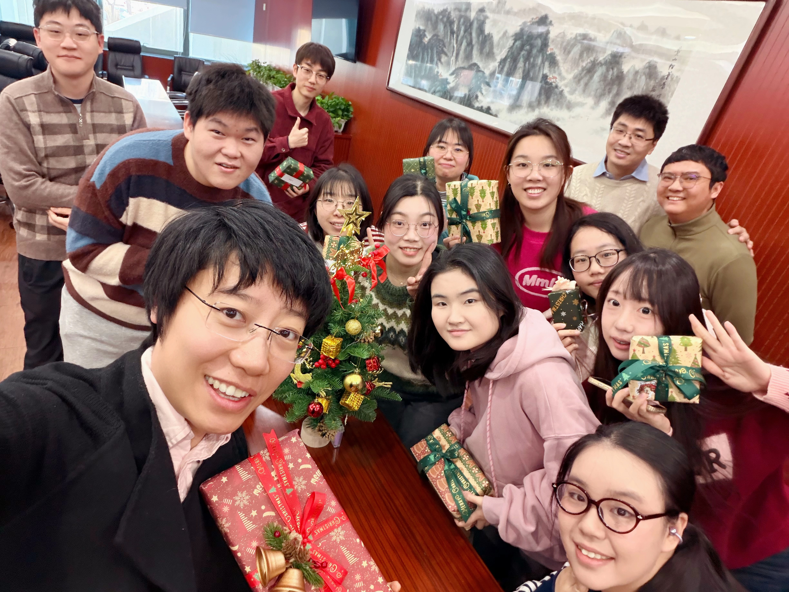

# AJ Research Group 网站使用说明书

## 目录结构

```
webtest/
├── index.html            首页
├── anjie.html            安杰（PI 主页）
├── research.html         研究方向
├── news.html             课题组新闻
├── publications.html     已发表成果
├── gallery.html          课题组照片
├── contact.html          联系我们
│
├── css/
│   └── style.css         全站样式（颜色、布局、响应式）
│
├── js/
│   ├── i18n.js           中英文切换逻辑及翻译内容
│   ├── main.js           导航栏交互
│   ├── carousel.js       首页论文轮播
│   ├── publications.js   成果页面渲染
│   └── news.js           新闻页面渲染
│
├── data/
│   ├── publications.json ★ 论文数据（在此添加新论文）
│   └── news.json         ★ 新闻数据（在此添加新动态）
│
└── images/
    ├── logo/
    │   └── LOGO.png            导航栏 Logo（替换即生效）
    ├── team/
    │   ├── pi-photo.webp       安杰老师个人照片
    │   └── group-2025-12.jpg   课题组合影（首页展示）
    ├── publications/
    │   ├── pub-1.webp          论文封面图（与 publications.json 对应）
    │   └── ...
    ├── news/
    │   └── ...                 新闻配图（与 news.json 对应）
    └── gallery/
        └── ...                 课题组照片页图片（待添加）
```

---

## 常见更新操作

### 1. 添加一篇新论文

编辑 `data/publications.json`，在数组**最前面**插入一条记录：

```json
{
  "title": "论文标题（英文）",
  "authors": "Wang, X.; ...; An, J.",
  "citation": "期刊名 年份, 卷 (期), 页码.",
  "doi": "https://doi.org/10.xxxx/xxxxx",
  "isFeatured": true,
  "image": "images/publications/pub-6.webp"
}
```

- `isFeatured: true` → 显示为带封面图的卡片（代表性成果区）  
- `isFeatured: false` → 显示为纯文字列表（更多成果区）  
- `image` 留空字符串 `""` 表示无封面图  
- 封面图放入 `images/publications/`，命名建议 `pub-6.webp`、`pub-7.webp`……

---

### 2. 添加一条新闻

编辑 `data/news.json`，在数组**最前面**插入：

```json
{
  "title": "新闻标题",
  "image": "images/news/news-2025-01.jpg",
  "date": "2025-01-15",
  "excerpt": "简短描述，显示在新闻卡片上。",
  "link": ""
}
```

- 配图放入 `images/news/`，建议按日期命名，如 `news-2025-01.jpg`  
- `link` 填外部链接（如论文 DOI），留空则无跳转

---

### 3. 更换课题组照片（首页大图）

将新照片放入 `images/team/`，然后修改 `index.html`：

```html
<!-- 找到这一行，把文件名改成新图片 -->

```

---

### 4. 添加课题组照片页图片

将照片放入 `images/gallery/`，然后在 `gallery.html` 中添加：

```html
<figure class="gallery-item-large">
  
  <figcaption>图片说明文字</figcaption>
</figure>
```

---

### 5. 修改中英文翻译

编辑 `js/i18n.js`，找到对应的 `zh` 或 `en` 对象修改文字。  
格式：`键名: "文字内容"`

---

### 6. 更换 Logo

将新 Logo 文件命名为 `LOGO.png`，替换 `images/logo/LOGO.png` 即可。  
建议使用透明背景 PNG，高度约 200px 以上（网页会自动缩放至 62px 高）。

---

## 图片命名建议

| 类型 | 存放位置 | 命名规则 |
|------|----------|----------|
| 论文封面 | `images/publications/` | `pub-6.webp`, `pub-7.jpg` … |
| 新闻配图 | `images/news/` | `news-YYYY-MM.jpg` |
| 课题组合影 | `images/team/` | `group-YYYY-MM.jpg` |
| 课题组照片页 | `images/gallery/` | 自由命名 |

推荐格式：`.webp`（体积小）或 `.jpg`。封面图建议宽度不超过 1200px。

---

## 本地预览方法

直接双击 `index.html` 在浏览器打开**可以**看到基本样式，但新闻和论文数据需要通过本地服务器加载。推荐：

```bash
# 在 webtest 目录下运行（需要 Python）
python -m http.server 8080
# 然后访问 http://localhost:8080
```

或安装 VS Code 插件 **Live Server**，右键 `index.html` → Open with Live Server。
